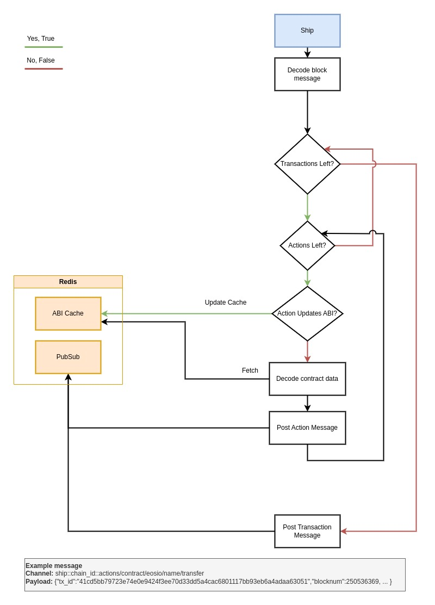

# Architecture

Below is the diagram of how Thalos processes messages from a SHIP Node

## Decoding Binary Format

When leveraging the Antelope State History plugin (SHIP), developers have the capability to stream blockchain data via a WebSocket connection.
Nevertheless, the process of decoding the binary format and managing the WebSocket connection can prove to be laborious and time-intensive.
Thalos alleviates these challenges by assuming the responsibility of decoding the binary messages on behalf of developers.
It seamlessly transforms the data received from the SHIP node into plain JSON format (and can be adapted to other prevalent formats if desired).
JSON, being widely supported, has many implementations across various programming languages.

## Contract ABIs

Thalos simplifies the decoding of contract-specific data by maintaining an internal cache of contract ABIs. This cache, which is stored in Redis, allows for efficient retrieval of contract information. There are two ways in which the cache can be populated:

1. **API Node**: Thalos can query the contract ABI through an API node, populating the cache with the retrieved information.
2. **SHIP Node Messages**: Thalos keeps track of updates from the SHIP node, and when a contract is updated, it automatically updates its internal cache with the latest ABI information.

## Redis - PubSub vs Stream

Thalos utilizes Redis's publish/subscribe model known as Pub/Sub, which offers the following advantages:

1. **Decoupled communication**: Pub/Sub enables loose coupling between publishers and subscribers. Publishers are unaware of the subscribers, and subscribers can join or leave independently, without affecting the publishing process.

2. **Scalability**: Redis Pub/Sub is designed to handle high message throughput and efficiently distribute messages to a large number of subscribers. It can handle a high volume of messages without compromising performance.

3. **Simple implementation**: Redis's Pub/Sub mechanism is easy to implement, involving basic operations such as subscribing to channels, publishing messages, and receiving messages. This simplicity facilitates development and integration with other systems.

4. **Asynchronous communication**: Pub/Sub operates asynchronously, allowing publishers to send messages without waiting for subscribers to receive them. This decoupling is advantageous in scenarios where immediate response or synchronization is not necessary.

However, these advantages can also be considered drawbacks in certain situations. Pub/Sub may encounter issues with message persistence:

- **Message loss**: If clients disconnect and reconnect, they may miss messages published during their absence. Similarly, if a client cannot process messages quickly enough, it may not receive all messages.

- **Immediate message consumption**: Pub/Sub requires subscribers to consume messages immediately upon publication. If a client is unable to read a message promptly, it is discarded.

In contrast, Streams in Redis provide built-in message persistence. Messages are stored as entries in the stream and can be consumed at any time, even if they were published before the subscriber connected.
This feature addresses the drawbacks of immediate message consumption and message loss associated with Pub/Sub.

Currently, Streams are not implemented in Thalos. However, there are plans to consider implementing Streams in the future, based on the demand for such functionality. It's important to note that Streams introduce additional complexity to the client implementation.
