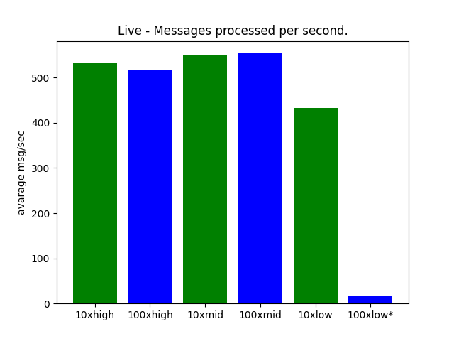
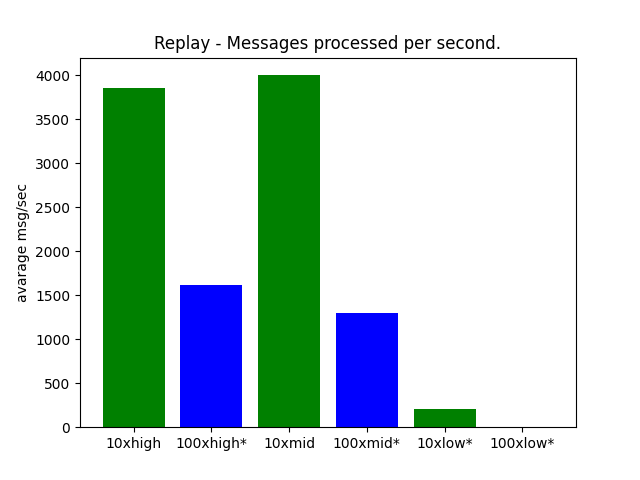

# Benchmark

Thalos demonstrates impressive speed, and we have solid data to support this claim.

We conducted two distinct types of benchmark tests:

* **Live Benchmark**: Thalos was thoroughly benchmarked against streaming data from the current head block. This benchmark provides a highly realistic evaluation, although it operates at a slightly slower pace due to real-time processing limitations. Notably, the potential bottleneck arises from the fact that a new block is generated only once every 0.5 seconds.

* **Replay Benchmark**: Thalos was operated in replay mode, utilizing data from a previous block.
This mode allows for higher throughput as it eliminates real-time constraints since historical blocks have already been generated.
Therefore, Thalos does not have to wait 0.5 second for the next block.

In addition to the aforementioned test types, it is important to assess the impact of multiple clients on performance. Therefore, we categorize the results as `NxHardware`, where `N` represents the number of clients and `Hardware` signifies the hardware configuration used. For example, the designation `10xlow` indicates 10 clients using low-end hardware.

All tests were diligently conducted on the WAX Mainnet.

## Hardware

The following hardware was used.

1. **Low-end**: Raspberry Pi 3 Model B Rev 1.2
2. **Mid-end**: Intel(R) Xeon(R) W-2125 CPU 4-Core (8 threads) @ 4.0GHz
3. **High-end**: 2x Intel(R) Xeon(R) Gold 6128 CPU 6-cores (12 threads) @ 3.4GHz

Please note that during the tests conducted on mid and high-end hardware, additional services that consume resources were present.
This was due to the unavailability of idle servers for testing purposes.
Consequently, it is important to consider that the performance on these hardware configurations could potentially be even better than the results obtained.

## Live

\* Redis discards messages for clients because they cannot be processed in time. resulting in dataloss.

Raw data:

| 10xhigh           | 100xhigh          | 10xmid            | 100xmid           | 10xlow             | 100xlow*           |
| ----------------- | ----------------- | ----------------- | ----------------- | ------------------ | ------------------ |
| 531.9520324320212 | 517.2177668044619 | 549.1276634032015 | 553.6179173960732 | 432.66369389719085 | 17.004179093675067 |

These results are quite interesting. High and mid-end hardware are about equal even for 100 clients. And the low-end hardware is not so far of. capable of handling atleast 10 clients.

Note that one block contains alot of transactions and actions resulting in alot more then one redis message per block. therefore even if there is just 2 blocks per second. There is alot more redis messages sent out.

## Replay

\* Redis discards messages for clients because they cannot be processed in time. resulting in dataloss.

Raw data:

| 10xhigh           | 100xhigh*          | 10xmid             | 100xmid*           | 10xlow*            | 100xlow*           |
| ----------------- | ------------------ | ------------------ | ------------------ | ------------------ | ------------------ |
| 3853.401198489492 | 1614.2395356540624 | 4002.5386670846724 | 1297.8602672923382 | 211.21962626224587 | 0                  |

The benchmarking of 100 clients on low-end hardware was intentionally excluded. The system's responsiveness was severely compromised during the test with 100 clients using live data, and running the same test on 100 clients with replay data would not make it better.
it is just as 10xlow, not usable.

## Conclusion

By looking at the live data graphs they process roughly the same amount of messages per second. That is because the bottleneck is the blockchain
itself. If we look at the replay data, redis clients can't keep up as number of clients increases. however, it is still pretty fast. consider that all 10x clients performs roughly equal.

Also the fact that the benchmark tests fetchees **all** messages. That is pretty unrealistic as applications should in 99% of the cases only care about actions on a subset of contracts. Only case where you would want all actions is if you are building some sort of blockexplorer.
